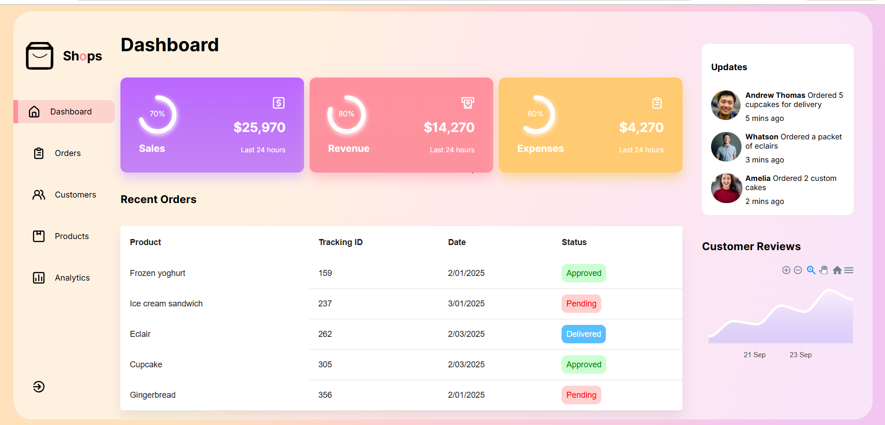
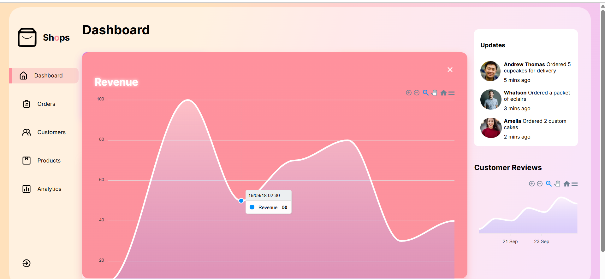

# Dashboard Starter

A modern, responsive React dashboard with real-time data visualization, order tracking, and analytics. Built with Framer Motion animations, ApexCharts, and Material-UI components.

## Screenshots




## Features

**Key Features**
- **Interactive Cards**  Expandable compact cards with circular progress indicators
- **Real-time Charts**  Area charts with ApexCharts for analytics visualization
- **Order Management**  Table view for recent orders with status tracking
- **Updates Section**  Live system updates with timestamps
- **Customer Reviews**  Customer feedback and ratings display
- **Responsive Design**  Mobile-friendly layout with adaptive grid
- **Smooth Animations** Framer Motion transitions and shared layout animations
- **Dark/Light Theme** CSS variables for easy theme customization

## Tech Stack

- **React 18**  UI library
- **Framer Motion**  Animation and motion effects
- **ApexCharts**  Data visualization
- **Material-UI (MUI)**  Table and UI components
- **React Circular Progressbar**  Progress indicators
- **Unicons**  Icon library
- **CSS3** Custom styling with CSS variables


## Installation

1. Clone the repository:
```bash
git clone <repo-url>
cd Dashboard-starter
```

2. Install dependencies:
```bash
npm install
```

3. Start the development server:
```bash
npm start
```

4. Open [http://localhost:3000](http://localhost:3000) in your browser.

## Usage

### Expandable Cards
- Click on any card to expand and view detailed analytics
- Press Enter/Space for keyboard accessibility
- Click the close icon to collapse

### Data Customization
Edit `src/Data/Data.js` to:
- Update card data (title, value, progress)
- Modify chart series data
- Change card colors and styling

